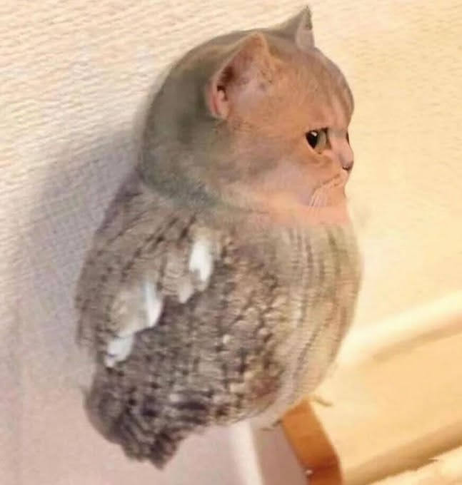

# ascii-image-converter

`ascii-conv` converts PNG, JPEG, GIF, WebP, and BMP images into ASCII art. It handles terminal dimension auto-detection, font aspect-ratio correction, resampling filters, and custom character ramps.

## Installation

```bash
foo@bar:~$ git clone git@github.com:mertso13/ascii-image-converter.git
foo@bar:~$ cd ascii-image-converter
foo@bar:~/ascii-image-converter$ go build -o ascii-conv ./cmd/ascii-conv
```

## Usage

```bash
# Auto-detect terminal width
foo@bar:~/ascii-image-converter$ ./ascii-conv path/to/image.png

# Set custom width and palette
foo@bar:~/ascii-image-converter$ ./ascii-conv -w 80 -p blocks path/to/image.png

# Invert ramp for light backgrounds
foo@bar:~/ascii-image-converter$ ./ascii-conv -w 80 -i path/to/image.png

# Save output to a file
foo@bar:~/ascii-image-converter$ ./ascii-conv -w 100 -o result.txt path/to/image.png
```

## CLI Flags

| Flag | Type | Default | Description |
| :--- | :--- | :--- | :--- |
| `-w, --width` | int | Auto-detect | Target width in characters |
| `-H, --height` | int | Auto-detect | Target height in characters |
| `-p, --palette` | string | `standard` | Preset ramp (`standard`, `extended`, `minimal`, `blocks`) |
| `-r, --ramp` | string | `""` | Custom character ramp string |
| `-i, --invert` | bool | `false` | Invert character ramp luminosity |
| `-s, --scale` | float | `0.5` | Font aspect ratio multiplier |
| `-f, --filter` | string | `bilinear` | Resampling filter (`bilinear`, `nearest`, `bicubic`) |
| `-o, --output` | string | `""` | Output file path |

## Example

```bash
foo@bar:~/ascii-image-converter$ ./ascii-conv -w 55 examples/example_image.jpeg
```

### Original Image



### ASCII Output

```text
%%%%%%%%%%%%%%%%%%%%%%%%%%%%%%%%%%%#*%%%%%%%%%%%%%%%%%%
%%%%%%%%%%%%%%%%%%%%%%%%%%%######*+++#%%%%%%%%%%%%%%%%%
%%%%%%%%%%%%%%%%%%%%%%##**+++++++==++#%%%%%%%%%%%%%%%%%
%%%%%%%%%%%%%%%%%%%%#*+=======++++++++*#%%%%%%%%%%%%%%%
%%%%%%%%%%%%%%%%%%#*+=---=--=+++++++++++*#%%%%%%%%%%%%%
%%%%%%%%%%%%%%%%%#+===---=-=+++++++++++++*%%%%%%%%%%%%%
%%%%%%%%%%%%%%%##+===----=+=++++++++++++++#%%%%%%%%%%%%
%%%%%%%%#######*+====-----===++++++++==++*%%%%%%%%%%%%%
%%%%%%#####****+=====--=====++++++++=-=+**%%%%%%%%%%%%%
%%%%%##*****++++===========++++++++++++++*%%%%%%%%%%%%%
%%%###*****++++==-=====+==+++++++*********%%%%%%%%%%%%%
%%###*******++=-=========+++*************#%%%%%%%%%%%%%
%###********+====+++=====++++***********##%%%%%%%%%%%%%
###********+====+++====+++++++*******#**##%%%%%%%%%%%%%
##********++==++======+##*+++++++********##%%%%%%%%%%%%
##********+======+++*+*%%+=====+++********#%%%%%%%%%%%%
##*******+======+*++****#===+++==+++*++****%%%%%%%%%%%%
##*******+===++**#*++**++==+++++++*****+**#%%%%%%%%%%%%
#********====+***##=-===+==++++++*********%%%%%%%%%@@%%
#********+===+*#*++-====+==++++++********#%%%@@%%%%%###
*********++==*#*========+=+++===+*****#*#%@%%%%%#####%%
***********++*+==-======++=======+***###%%%%#####%%%%%%
***********+=-=========+++===++==+***##%%%%%%%%%%%%%%%%
***##*****+=----=--=+=====++++===+***#%%%%%%%%%%%%%%%##
***######*+=-----:-==----==+++++**+++##%%%%%%%%%%%#####
#**#######*+=-:------===+***##**++++++#%%%%%%%%%#######
#**#########*+=---::-+***#*#%%*+++=====*#%%%%%####*****
#**###########*+++==*###***##%#++++==---*#####******#%%
##################**###*****#%#*++++=---+******###%%%%%
```
